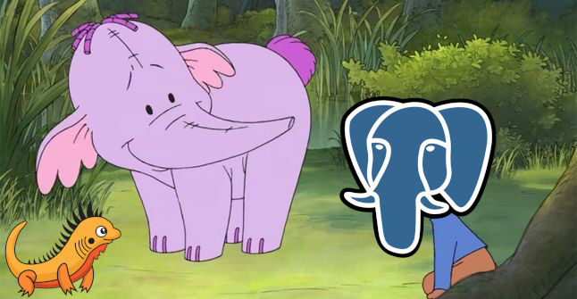

# Heffalump

Looks like `psycopg`, but we have allocators



### Build

In your `build.zig` add

```zig
pub fn build(b: *std.Build) !void {
    //...
    const heffalump = b.dependency("heffalump", .{
            .target = target,
            .optimize = optimize,
        });

        exe.addModule("heffalump", heffalump.module("heffalump"));
        exe.linkLibrary(heffalump.artifact("heffalump"));

    // ...
        b.installArtifact(exe);
    // ...
}
```

and the `build.zig.zon` should look like this

```
.{
    // ...
    .dependencies = .{
        // ...
        .heffalump = .{
            .url = "https://github.com/luizpbraga/heffalump/archive/refs/tags/v0.0.1.tar.gz",
            .hash = "122043f5d763462a23e11375f2d5938ad41651aad6e9c3b2f688f07be81ee59f1390",
        },
    }
}

```

then run `zig build`.

### Example

```zig
const std = @import("std");
const heffa = @import("heffalump"); // no '.zig' here
const ally = std.testing.allocator;

test "Hefallump test" {
    //
    // Database settings
    //
    const dsn = "user=postgres password=postgres dbname=testdb host=localhost";

    //
    // Start The Connection
    //
    var conn = try heffa.Connection.init(ally, dsn);
    defer conn.deinit();

    //
    // Fetch Some Data
    //
    var result = try conn.exec("SELECT * FROM cars", .{});
    defer result.deinit();

    //
    // Iterate Over The Data
    //
    var rows = result.rows(ally);
    while (rows.next()) |row| {
        var id: u8 = undefined;
        var price: usize = undefined;
        var name: []const u8 = undefined;
        try row.scan(.{ &id, &name, &price });

        std.debug.print("id: {}, name: {s}, price: {}\n", .{ id, name, price });
    }
}
```
